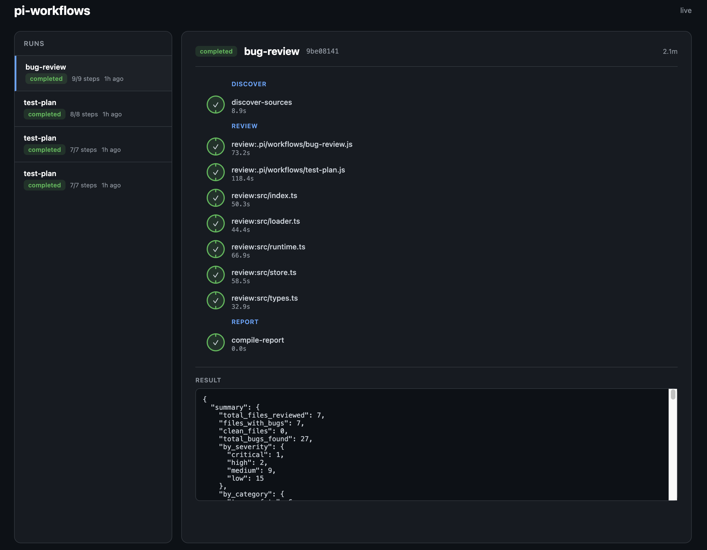

# pi-workflows

A [pi](https://github.com/earendil-works/pi-coding-agent) extension that adds workflow orchestration — define multi-step agent pipelines as simple JavaScript scripts and run them from the TUI.

## Dashboard

Run `/dashboard` to start a local web dashboard showing live workflow runs with a tree visualization of steps and phases.



## Features

- **Discover** workflows from `.pi/workflows/`, `.agents/workflows/`, `.pi-workflows/` in the project tree and `~/.pi/agent/workflows/` globally
- **Execute** workflows with the `workflow` tool or `/workflow` command
- **Pipeline** processing with concurrent items and sequential stages
- **Agent spawning** with optional JSON schema for structured output
- **Run tracking** with persistent status, steps, and results

## Setup

```bash
git clone https://github.com/umutbasal/pi-workflows.git
cd pi-workflows
bun install
```

### Install extension

```bash
pi extensions add ./src/index.ts
```

Or copy manually:

```bash
cp -r src ~/.pi/agent/extensions/pi-workflows
```

### Install skill

```bash
cp -r skills/create-workflow ~/.pi/agent/skills/
```

This installs the `create-workflow` skill which gives the AI full context on how to write workflows when asked to create one.

## Writing Workflows

Create a `.js` or `.ts` file in `.pi/workflows/`:

```js
// .pi/workflows/my-workflow.js
export const meta = {
  name: "my-workflow",
  description: "Does something useful",
  phases: [
    { title: "Discover", detail: "find files" },
    { title: "Process", detail: "process each file" },
  ],
};

export default async function ({ agent, pipeline, step, log, args }) {
  log("Starting...");

  // Spawn an agent with full tool access
  const files = await agent("Find all TypeScript files in src/", {
    label: "find-files",
    phase: "Discover",
    schema: { type: "array", items: { type: "string" } },
  });

  // Process items through stages (concurrent within each stage)
  const results = await pipeline(
    files,
    (file) => agent(`Analyze ${file}`, { label: `analyze:${file}`, phase: "Process" }),
  );

  return { files, results };
}
```

## Runtime API

Workflows receive a runtime object with:

| Function | Description |
|----------|-------------|
| `agent(prompt, opts?)` | Spawn a sub-agent with full tool access (read/write/bash/grep). Returns text or parsed JSON if `schema` is provided. |
| `pipeline(items, ...stages)` | Process items through stages. Items within a stage run concurrently; stages run sequentially. |
| `step(name, phase, fn)` | Wrap arbitrary (non-agent) logic as a tracked step. Reports running→completed/failed to the runtime. Returns the value from `fn()`. |
| `log(message)` | Show a notification in the TUI. |
| `args` | Parsed JSON arguments passed to the workflow. |

### Agent Options

```ts
interface AgentOptions {
  label?: string;              // Display name for step tracking
  phase?: string;              // Phase grouping (matches meta.phases)
  schema?: Record<string, unknown>; // JSON schema for structured output
}
```

### Step Function

```ts
type StepFn = <T>(name: string, phase: string, fn: () => T | Promise<T>) => Promise<T>;
```

Use `step()` to wrap non-agent logic (data transformation, compilation, local computation) so it appears as a tracked step in the run. This is essential for phases that don't involve agent calls.

```js
const report = await step("compile-report", "Report", async () => {
  // local computation, no agent needed
  return { summary: computeSummary(data) };
});
```

## Workflow Writing Rules

> **Every phase declared in `meta.phases` MUST be tracked in the workflow code.**

When writing workflows, follow these rules:

1. **All declared phases must be used.** If `meta.phases` lists a phase (e.g. `"Report"`), the workflow code MUST reference that phase — either via `agent(..., { phase: "Report" })` or `step("name", "Report", fn)`. A phase declared but never tracked is a bug.

2. **Use `step()` for non-agent phases.** If a phase involves only local computation (aggregation, formatting, filtering), wrap it in `step(name, phase, fn)`. Do NOT leave it as bare code outside any phase tracking.

3. **Phase names must match exactly.** The `phase` string in `agent()` options or `step()` calls must match a `title` in `meta.phases` exactly (case-sensitive).

4. **Destructure `step` from the runtime.** The function signature should be:
   ```js
   export default async function ({ agent, pipeline, step, log, args }) {
   ```

5. **Return values from `step()`.** If the final phase produces the workflow result, return it directly:
   ```js
   return await step("compile", "Report", async () => {
     return { summary, details };
   });
   ```

6. **One phase per logical unit.** Don't mix multiple phases in a single `agent()` or `step()` call. Each tracked call should belong to exactly one phase.

## Usage

### Quick Example: Test Planning Workflow

Create `.pi/workflows/test-plan.js`:

```js
export const meta = {
  name: "test-plan",
  description: "Analyze source files and decide what to test, how, and priority",
};

export default async function ({ agent, pipeline, log }) {
  const files = await agent("List all source files in src/. Return only the file paths.", {
    schema: { type: "array", items: { type: "string" } },
  });

  log(`Found ${files.length} files to analyze`);

  const plans = await pipeline(files, (file) =>
    agent(
      `Analyze ${file} and decide:
      - What should be tested?
      - Test type: unit or integration?
      - Priority: high, medium, or low?
      Return a plan for this file.`,
      {
        label: `plan:${file}`,
        schema: {
          type: "object",
          properties: {
            file: { type: "string" },
            tests: {
              type: "array",
              items: {
                type: "object",
                properties: {
                  description: { type: "string" },
                  type: { type: "string", enum: ["unit", "integration"] },
                  priority: { type: "string", enum: ["high", "medium", "low"] },
                },
              },
            },
          },
        },
      }
    )
  );

  return plans;
}
```

Run it:

```
/workflow test-plan
```

### From the tool

```
Use the workflow tool to start "my-workflow" with args: {"dir": "./src"}
```

### From the command

```
/workflow my-workflow {"dir": "./src"}
/workflow list
```

### Actions

| Action | Description |
|--------|-------------|
| `start` | Execute a workflow (default) |
| `list` | List available workflows and recent runs |
| `status` | Check a run's status by `run_id` |
| `cancel` | Cancel a running workflow by `run_id` |

## Project Structure

```
src/
├── index.ts          # Extension entry point, tool & command registration
├── loader.ts         # Workflow discovery & module loading
├── runtime.ts        # Agent, pipeline, and log runtime creation
├── store.ts          # Run persistence (JSON files in .pi-workflows/.runs/)
├── types.ts          # TypeScript interfaces
├── runtime.test.ts   # Unit tests for runtime (agent, pipeline, log)
├── store.test.ts     # Unit tests for persistence layer
└── format.test.ts    # Unit tests for run formatting
```

## Testing

```bash
bun test
```

```
 39 pass, 0 fail
 75 expect() calls
 Ran 39 tests across 3 files
```

## Workflow Discovery Order

Workflows are searched in this order (first match wins):

1. `.pi/workflows/` — project-local (traverses up to git root)
2. `.agents/workflows/` — project-local (traverses up to git root)
3. `.pi-workflows/` — project-local (traverses up to git root)
4. `~/.pi/agent/workflows/` — global
5. `~/.agents/workflows/` — global

Project workflows override global ones with the same name.

## References

- [security-workflows](https://github.com/umutbasal/security-workflows) — Standalone usecase of pi workflows for security analysis

## License

MIT
